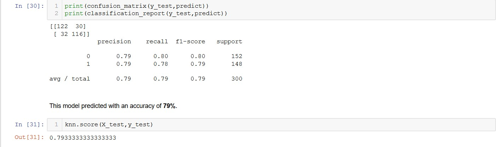
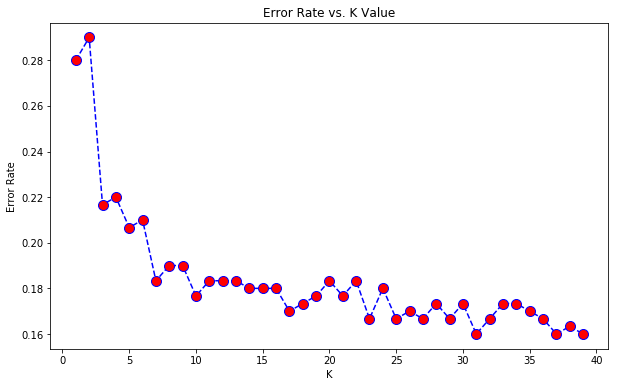
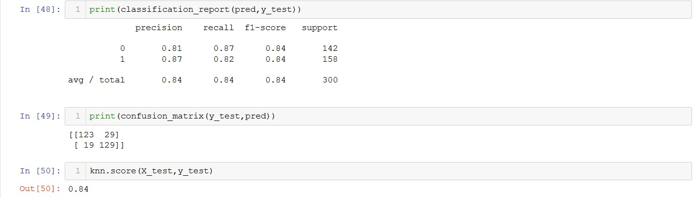

# K-Nearest-Neighbors
Improving the performance of KNN for classification problems. 

## 1) Initial Model Performance

## 2) Improving the Parameter K
                                                                                                                                
As we can see that at **k=31** the error is least, hence the best value for K is 31.

## 3) Final Model Performance

